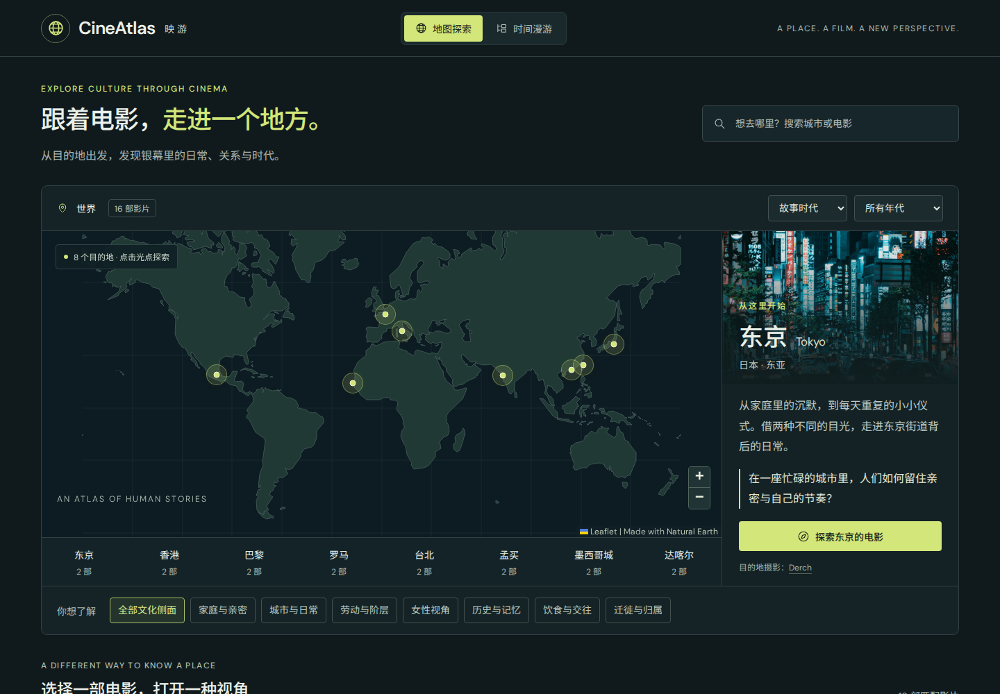

# 映游 · CineAtlas

**Explore a place through its films.** CineAtlas is a Chinese-language cultural film atlas for curious travelers. Choose a destination, discover the everyday lives and relationships on screen, and carry a new question into the real place.

The first collection contains **8 destinations and 16 films**: Tokyo, Hong Kong, Paris, Rome, Taipei, Mumbai, Mexico City and Dakar. This is an explicitly limited, expandable editorial sample.



## Run locally

Requires Node.js 22.12 or newer. No API keys, login or database are needed.

```bash
npm ci
npm run dev -- --host 127.0.0.1 --port 5188 --strictPort
```

Open **http://127.0.0.1:5188/**. If running on a remote machine, forward port 5188 through SSH or your editor. The development service stays on loopback.

For the production build:

```bash
npm run build
npm run preview -- --host 127.0.0.1 --port 5188 --strictPort
```

`dist/` is a static website. Relative asset URLs and hash routes support hosting at a domain root or repository subpath. Deploy it through an account owned by Baixue; no hosting account is configured in this repository.

## Explore

- Click a world-map marker or choose a destination from the list.
- Filter by cultural interest, such as family, daily life, food, women's perspectives or migration.
- Switch between the era depicted in a film and its release decade. Approximate and cross-decade settings are explained in each guide.
- Open a film for a cultural reading, things to notice, a question for the trip, place/period context and source links.
- Use the chronological view to compare portrayals across time. Search matches destinations, titles, directors and cultural themes.
- Refresh or use browser history without losing the current exploration. The same journey works on mobile and with keyboard navigation.

The map uses locally bundled public-domain land geometry. Destination photography is also local. Google Fonts is optional; system fonts take over if unavailable. External film-source links require a network connection. The site does not stream films or promise current viewing availability.

## Verify

```bash
npm run validate:data
npm test
npm run build
npx playwright install chromium
npm run test:e2e
```

Browser tests exercise the production build, including map navigation, filtering, modal focus, history, deep links, mobile layout, enlarged text and map-load failure recovery. [Content maintenance](docs/content-guide.md), [design decisions](docs/design-decisions.md) and [validation notes](docs/validation.md) explain the scope and limitations.

## Open-source adaptation and credits

The map components and hash router adapt [The Chronicle of Light](https://github.com/rafsunsheikh/The-Chronicle-of-Light) by MD Rafsun Sheikh. CineAtlas changes the data model, discovery flow and presentation for cultural travel. It does not use the original historical dataset, media, accounts or 3D graph. Exact source provenance: [docs/upstream.json](docs/upstream.json).

Code and original guide text: [MIT](LICENSE). Destination photography and map data retain their separate terms, listed in [THIRD_PARTY_NOTICES.md](THIRD_PARTY_NOTICES.md). Film-source links are visible in every guide.

Project by **Baixue Wu** · [Baixue-Wu/CineAtlas](https://github.com/Baixue-Wu/CineAtlas).
